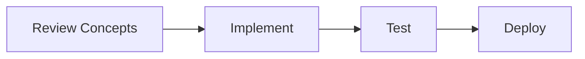

🚀 # 📑 Complete ML Career Roadmap Index & Navigation

> [!TIP]
> **Document Workflow**




**Last Updated:** May 30, 2026  
**Files Created:** 9 comprehensive guides  
**Total Content:** 5000+ lines of practical advice  
**Status:** ✅ Ready to use (locally committed, ready to push to GitHub)

---

✨ ## 🗂️ **Complete File Structure**

```
ML-Career-Roadmap/
│
├── 📄 README.md                          ← START HERE (Main entry point)
│   ├─ Quick navigation
│   ├─ Timeline overview  
│   ├─ Which specialization path
│   ├─ Tools needed
│   ├─ Success checklist
│   └─ Action plan starting today
│
├── 📄 PUSH_TO_GITHUB.md                  ← How to share your repo
│   ├─ Step-by-step GitHub push
│   ├─ Verification steps
│   ├─ Daily workflow
│   └─ Portfolio impact
│
├── 📂 roadmaps/
│   └── 📄 1-2-3_MONTH_ROADMAPS.md       ← Big picture timeline
│       ├─ 1-Month: Fundamentals
│       │  ├─ Week 1: Python Stack (40h)
│       │  ├─ Week 2: ML Basics (35h)
│       │  ├─ Week 3: Advanced ML (40h)
│       │  └─ Week 4: Capstone (35h)
│       ├─ 2-Month: Specialization  
│       │  ├─ Track A: Data Science (statistical, causal)
│       │  ├─ Track B: Deep Learning (CNNs, NLP, transformers)
│       │  └─ Track C: ML Engineering (systems, MLOps, scaling)
│       └─ 3-Month: Job-Ready
│          ├─ DSA mastery
│          ├─ System design
│          ├─ Interview prep
│          └─ Job search strategy
│
├── 📂 learning-resources/
│   ├── 📄 DAY_BY_DAY_SCHEDULE.md        ← Day-by-day with resource links
│   │   ├─ Day 1-7: Week 1 schedule
│   │   ├─ Day 8-14: Week 2 schedule
│   │   ├─ Day 15-21: Week 3 schedule
│   │   ├─ Day 22-30: Week 4 schedule
│   │   └─ Resource links & timing
│   │
│   ├── 📄 KAGGLE_COMPETITION_GUIDE.md  ← How to win competitions
│   │   ├─ Best competitions for beginners
│   │   ├─ Step-by-step approach
│   │   ├─ EDA tips
│   │   ├─ Feature engineering tricks
│   │   ├─ Model building strategy
│   │   ├─ Hyperparameter tuning
│   │   ├─ Ensemble methods
│   │   ├─ Common mistakes
│   │   └─ Portfolio use
│   │
│   └── [Future: Add ML blog posts, case studies]
│
├── 📂 project-templates/
│   ├── 📄 PROJECT_TEMPLATE.md           ← How to structure projects
│   │   ├─ Production directory structure
│   │   ├─ README template
│   │   ├─ requirements.txt template
│   │   ├─ setup.py example
│   │   ├─ Makefile template
│   │   ├─ .gitignore template
│   │   ├─ Code quality checklist
│   │   └─ Best practices
│   │
│   ├── [TODO: Project 1 - Titanic EDA]
│   ├── [TODO: Project 2 - Housing Prediction]
│   ├── [TODO: Project 3 - Kaggle Competition]
│   └── [TODO: Project 4 - End-to-End ML System]
│
├── 📂 interview-prep/
│   ├── 📄 ML_CONCEPTS_INTERVIEW_GUIDE.md ← 10 ML concepts explained
│   │   ├─ 1. Bias-Variance Tradeoff (math + code + interview answer)
│   │   ├─ 2. Overfitting vs Underfitting (detection + solutions)
│   │   ├─ 3. Cross-Validation (types + code examples)
│   │   ├─ 4. Regularization L1/L2 (Ridge/Lasso + code)
│   │   ├─ 5. Feature Scaling (normalization + standardization)
│   │   ├─ 6. Class Imbalance (SMOTE + cost-sensitive)
│   │   ├─ 7. Model Evaluation Metrics (accuracy vs F1 vs AUC)
│   │   ├─ 8. Ensemble Methods (bagging, boosting, stacking)
│   │   ├─ 9. Hyperparameter Tuning (GridSearch vs Random)
│   │   ├─ 10. Feature Selection (importance + techniques)
│   │   ├─ Real interview questions with answers
│   │   └─ Interview preparation checklist
│   │
│   └── [TODO: More Q&A, mock interviews, video explanations]
│
└── 📂 dsa-guide/
    ├── 📄 LEETCODE_ML_PROBLEMS.md      ← 50 essential problems
    │   ├─ Category 1: Arrays & Strings (10 problems)
    │   ├─ Category 2: Linked Lists (5 problems)
    │   ├─ Category 3: Trees (10 problems)
    │   ├─ Category 4: Graphs (10 problems)
    │   ├─ Category 5: Dynamic Programming (10 problems)
    │   ├─ Category 6: Math & Bit Manipulation (5 problems)
    │   └─ 10-week study plan with timing
    │
    └── 📄 DSA_PREPARATION_FOR_ML.md   ← What DSA you need
        ├─ DSA by role (ML Eng vs DS vs Data Eng)
        ├─ Minimum requirements by role
        ├─ Tailored study plans (3 tracks)
        ├─ ML-specific DSA scenarios
        ├─ Common patterns (caching, priority, aggregation)
        ├─ Importance ranking
        ├─ Interview simulation
        ├─ Study tips
        └─ DSA topics by relevance

```

---

✨ ## 🎯 **File-by-File Guide**

🔍 ### **1️⃣ README.md** (Main Landing Page)
- **Purpose:** Entry point for entire roadmap
- **Read When:** First thing, 10 mins
- **Key Sections:**
  - Timeline overview (1-3 months)
  - Specialization selection
  - Tools needed
  - Success checklist
  - Getting started

**Next Steps After Reading:**
→ Choose your specialization (Path A/B/C)  
→ Read [1-2-3_MONTH_ROADMAPS.md](roadmaps/1-2-3_MONTH_ROADMAPS.md)

---

🔍 ### **2️⃣ 1-2-3_MONTH_ROADMAPS.md** (Big Picture)
- **Purpose:** See your entire 3-month journey
- **Read When:** Planning phase (before Day 1), 20 mins
- **Key Sections:**
  - Month 1: 4 weeks → 4 projects (₹8-12L)
  - Month 2: 4 weeks → Choose specialization + 6 projects (₹12-18L)
  - Month 3: 4 weeks → Job search + interviews (₹15-25L)

**Structure:**
- Week-by-week breakdown
- Topics with depth level
- Projects for each week
- Resources and metrics
- Track A/B/C details

**Next Steps After Reading:**
→ Read [DAY_BY_DAY_SCHEDULE.md](learning-resources/DAY_BY_DAY_SCHEDULE.md) for Month 1  
→ Use [PROJECT_TEMPLATE.md](project-templates/PROJECT_TEMPLATE.md) for structure

---

🔍 ### **3️⃣ DAY_BY_DAY_SCHEDULE.md** (Detailed Learning Path)
- **Purpose:** Exactly what to learn each day with links
- **Read When:** Reference during Days 1-30, 20 mins intro + 30 mins per day
- **Key Sections:**
  - Day 1-7: NumPy, Pandas, Matplotlib, Stats, Features
  - Day 8-14: Regression, Classification, Evaluation, Tuning
  - Day 15-21: XGBoost, Kaggle, NNs, CNNs, Transfer Learning
  - Day 22-30: Capstone, ML concepts, DSA, SQL, Mock interviews

**Each Day Includes:**
- Morning (2h): What to watch
- Afternoon (3-5h): What to code
- Resources (links)
- Project deliverable
- GitHub commit message

**Next Steps After Reading:**
→ Start Day 1 materials  
→ Follow the schedule religiously

---

🔍 ### **4️⃣ PROJECT_TEMPLATE.md** (How to Build)
- **Purpose:** Production-ready structure for all projects
- **Use When:** Starting each new project
- **Key Sections:**
  - Directory structure template
  - README template (most important!)
  - requirements.txt template
  - setup.py template
  - Makefile template
  - .gitignore template
  - Code quality checklist

**Most Important:** README template shows what employers look for:
- Problem statement
- Data overview
- Approach & models
- Results & metrics
- How to run
- Future improvements

**Next Steps:**
→ Use this for every project  
→ Make sure README is comprehensive

---

🔍 ### **5️⃣ KAGGLE_COMPETITION_GUIDE.md** (Win Competitions)
- **Purpose:** How to excel at Kaggle Week 3 competition
- **Read When:** Before Week 3 (Day 15), 30 mins
- **Key Sections:**
  - Best competitions for beginners
  - How to approach a competition
  - Step-by-step process
  - EDA, cleaning, features, models
  - Hyperparameter tuning
  - Ensemble strategies
  - Portfolio use

**Recommended First Competition:**
- House Prices Advanced Regression (great for features)
- Credit Card Fraud (great for imbalance)
- Titanic (if not doing as main project)

**Next Steps:**
→ Apply approach to Week 3 competition  
→ Document your strategy in GitHub

---

🔍 ### **6️⃣ ML_CONCEPTS_INTERVIEW_GUIDE.md** (Land the Job)
- **Purpose:** Master 10 concepts interviewers ask
- **Read When:** Week 4 (2-3 hours), then as reference
- **Key Sections:**
  - 10 ML concepts with explanations
  - Each concept has: Theory + Math + Code + Interview answer
  - Real interview Q&A
  - Common follow-up questions

**10 Concepts Covered:**
1. Bias-Variance Tradeoff
2. Overfitting/Underfitting
3. Cross-Validation
4. Regularization
5. Feature Scaling
6. Class Imbalance
7. Evaluation Metrics
8. Ensemble Methods
9. Hyperparameter Tuning
10. Feature Selection

**Next Steps:**
→ Study 1 concept per day (Week 4)  
→ Practice explaining each without notes  
→ Use code examples in interviews

---

🔍 ### **7️⃣ LEETCODE_ML_PROBLEMS.md** (Coding Interviews)
- **Purpose:** 50 curated coding problems for ML roles
- **Use When:** Reference during problem-solving, 10 mins per problem selection
- **Key Sections:**
  - 50 problems organized by category
  - Easy/Medium/Hard split
  - ML relevance explanation
  - 10-week study plan
  - How to approach each problem

**Problem Categories:**
- Arrays (10) - Most common
- Linked Lists (5)
- Trees (10) - Important
- Graphs (10) - Important  
- DP (10) - Essential
- Math (5)
- Design (5)

**Next Steps:**
→ Start with Week 1 problems (Arrays)  
→ Allocate 5-10 per week
→ Track solutions on GitHub

---

🔍 ### **8️⃣ DSA_PREPARATION_FOR_ML.md** (Know What to Study)
- **Purpose:** Understand which DSA matters for YOUR role
- **Read When:** Before starting DSA (Day 15), 20 mins
- **Key Sections:**
  - DSA by role (ML Eng vs DS vs Data Eng)
  - Minimum requirements
  - 3 tailored study plans (8-10 weeks each)
  - ML-specific scenarios
  - Importance ranking
  - Interview simulation

**Key Insight:** Different roles need different DSA focus:
- ML Engineer: 60-80% DSA focus (50+ problems)
- Data Scientist: 30-40% DSA focus (25+ problems)
- Data Engineer: 80-90% DSA focus (70+ problems)

**Next Steps:**
→ Identify your target role  
→ Pick your study plan  
→ Solve problems systematically

---

🔍 ### **9️⃣ PUSH_TO_GITHUB.md** (Share Your Work)
- **Purpose:** Instructions to push this roadmap to GitHub
- **Use When:** After completing projects, 10 mins per push
- **Key Sections:**
  - Step-by-step GitHub setup
  - Troubleshooting
  - Daily workflow
  - Portfolio tips
  - Maintenance

**After Pushing:**
- Share link: "github.com/YOUR_USERNAME/ML-Career-Roadmap"
- Mention in interviews
- Get community stars
- Help others learn

**Next Steps:**
→ Create GitHub repo  
→ Push local code  
→ Share on social media

---

✨ ## 🚀 **How to Use This Roadmap**

🔍 ### **Option 1: Linear (Recommended for Beginners)**
```
Day 1 → Read README (10 mins)
     → Read 1-Month Roadmap (15 mins)
     → Start Day 1 of DAY_BY_DAY_SCHEDULE
     → Build project with PROJECT_TEMPLATE
     → Commit to GitHub daily
     ...repeat for 30 days
Day 30 → Study interview concepts (Week 4)
     → Practice LeetCode (Days 15-30)
     → Apply to jobs
```

🔍 ### **Option 2: By Priority (If Time-Constrained)**
```
Week 1: README → 1-Month Roadmap → Start learning
Week 2: Focus on projects, less DSA
Week 3: Add KAGGLE_COMPETITION_GUIDE
Week 4: Add ML_CONCEPTS_INTERVIEW_GUIDE
Week 5+: Add DSA if time allows
```

🔍 ### **Option 3: By Topic (Deep Learners)**
- Learning Data Science? → 1-Month Roadmap Track A
- Learning Deep Learning? → 1-Month Roadmap Track B
- Learning ML Engineering? → 1-Month Roadmap Track C
- Need DSA help? → DSA_PREPARATION_FOR_ML.md

---

✨ ## 📊 **Content Summary**

| File | Lines | Concepts | Code Examples | Difficulty |
|------|-------|----------|---------------|-----------|
| README.md | 400 | Overview, timeline | 0 | Easy |
| 1-2-3 Roadmaps | 800 | Topics, depth, projects | 0 | Easy |
| Day-by-Day Schedule | 700 | 30 days of learning | 50+ | Medium |
| Project Template | 300 | Structure, best practices | 5+ | Easy |
| Kaggle Guide | 500 | Competition strategy | 20+ | Medium |
| ML Concepts Guide | 900 | 10 ML concepts | 100+ | Hard |
| LeetCode Problems | 600 | 50 problems, patterns | 20+ | Hard |
| DSA for ML | 500 | DSA strategies | 10+ | Medium |
| **Total** | **~5000** | **100+** | **200+** | **Mixed** |

---

✨ ## ✅ **Your Roadmap is Complete!**

🔍 ### **You Now Have:**
- ✅ 1/2/3-month roadmaps
- ✅ Day-by-day schedule (30 days)
- ✅ Project structure templates
- ✅ Interview preparation guide
- ✅ Kaggle competition strategy
- ✅ DSA study plans
- ✅ 50 LeetCode problems curated
- ✅ 10 ML concepts explained
- ✅ GitHub pushing guide

🔍 ### **Total Value:**
- 5000+ lines of actionable advice
- 200+ code examples
- 100+ learning concepts
- 50+ interview questions
- 50+ coding problems
- 30+ resource links

---

✨ ## 🎯 **Your Next Action (Right Now)**

1. ✅ You're reading this
2. → Open [README.md](README.md)
3. → Read for 10 minutes
4. → Open [1-2-3_MONTH_ROADMAPS.md](roadmaps/1-2-3_MONTH_ROADMAPS.md)
5. → Decide your specialization path (A/B/C)
6. → Open [DAY_BY_DAY_SCHEDULE.md](learning-resources/DAY_BY_DAY_SCHEDULE.md)
7. → START DAY 1: NumPy Fundamentals (RIGHT NOW)
8. → Commit to GitHub tonight
9. → Repeat every day for 30 days
10. → Follow up with 2-month specialization
11. → Interview prep in Month 3
12. → Land ₹15-25L job! 🎉

---

✨ ## 📞 **File Questions Reference**

**Q: I'm new to ML, where do I start?**  
A: README.md → 1-2-3 Roadmaps → Day-by-Day Schedule

**Q: How do I structure my projects?**  
A: PROJECT_TEMPLATE.md (copy this structure for every project)

**Q: What should I learn this week?**  
A: DAY_BY_DAY_SCHEDULE.md (find your day)

**Q: How do I win at Kaggle?**  
A: KAGGLE_COMPETITION_GUIDE.md (Week 3 resource)

**Q: What will interviewers ask about ML?**  
A: ML_CONCEPTS_INTERVIEW_GUIDE.md (10 concepts + Q&A)

**Q: Which LeetCode problems should I solve?**  
A: LEETCODE_ML_PROBLEMS.md (50 problems + study plan)

**Q: Which DSA do I really need?**  
A: DSA_PREPARATION_FOR_ML.md (by role + importance)

**Q: How do I push to GitHub?**  
A: PUSH_TO_GITHUB.md (step-by-step)

**Q: What specialization should I choose?**  
A: README.md (Path A/B/C) or 1-2-3 Roadmaps (Month 2)

---

✨ ## 🏆 **You've Got Everything You Need**

**No more excuses. No more "I don't know where to start."**

Everything is laid out:
- ✅ What to learn (DAY_BY_DAY_SCHEDULE.md)
- ✅ How deep to learn (1-2-3_MONTH_ROADMAPS.md)
- ✅ How to build projects (PROJECT_TEMPLATE.md)
- ✅ How to interview (ML_CONCEPTS_INTERVIEW_GUIDE.md)
- ✅ How to code (LEETCODE_ML_PROBLEMS.md + DSA_PREPARATION_FOR_ML.md)
- ✅ How to win competitions (KAGGLE_COMPETITION_GUIDE.md)
- ✅ How to share (PUSH_TO_GITHUB.md)

---

**START TODAY. BUILD TOMORROW. INTERVIEW NEXT WEEK. LAND JOB IN 3 MONTHS.**

**Your ₹15-25L job is waiting. Go get it! 🚀**

---

*Created: May 30, 2026*  
*Last Updated: Today*  
*Version: 1.0 - Complete*  
*Status: Ready to Use*

**Let's build your ML career! 💪**

<!-- Formatting improvements -->


---
*🎯 **Pro Tip**: Consistency is key in Machine Learning. Keep building and exploring!*