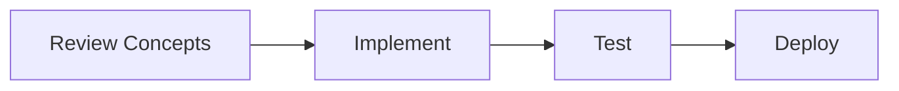

🚀 # 🚀 Push Your ML Career Roadmap to GitHub

> [!TIP]
> **Document Workflow**




**Status:** ✅ All files created and committed locally  
**Next:** Push to GitHub to share and version control

---

✨ ## **Quick Start (3 minutes)**

🔍 ### **Step 1: Create Empty Repository on GitHub**

1. Go to https://github.com/new
2. **Repository name:** `ML-Career-Roadmap`
3. **Description:** "Complete roadmap for landing ₹15-25L ML/AI jobs in 1-3 months"
4. **Visibility:** Public (so others can learn!)
5. Click **Create Repository** (don't add README, license, or gitignore)

---

🔍 ### **Step 2: Connect Local Repo to GitHub**

Copy-paste these commands (replace `YOUR_USERNAME`):

```bash
cd "c:\Users\91727\Desktop\ML-Career-Roadmap"

🚀 # Add remote (copy from GitHub: "…or push an existing repository from the command line")
git remote add origin https://github.com/YOUR_USERNAME/ML-Career-Roadmap.git

🚀 # Rename branch to main (if needed)
git branch -M main

🚀 # Push all commits to GitHub
git push -u origin main
```

---

🔍 ### **Step 3: Verify on GitHub**

Visit: `https://github.com/YOUR_USERNAME/ML-Career-Roadmap`

You should see:
- ✅ All folders (roadmaps, learning-resources, etc.)
- ✅ All files (README.md, guides, etc.)
- ✅ Green commit indicator
- ✅ File count: 8 files

---

✨ ## **If Using SSH (Recommended)**

If you have SSH set up:

```bash
git remote add origin git@github.com:YOUR_USERNAME/ML-Career-Roadmap.git
git branch -M main
git push -u origin main
```

---

✨ ## **Troubleshooting**

🔍 ### **"fatal: remote origin already exists"**
```bash
git remote remove origin
git remote add origin https://github.com/YOUR_USERNAME/ML-Career-Roadmap.git
git push -u origin main
```

🔍 ### **"Please make sure you have the correct access rights"**
- Check SSH key setup
- Or use HTTPS instead:
```bash
git remote set-url origin https://github.com/YOUR_USERNAME/ML-Career-Roadmap.git
```

🔍 ### **"main branch doesn't exist"**
```bash
git checkout -b main
git push -u origin main
```

---

✨ ## **After Pushing: Share Your Repo**

🔍 ### **Add to Your Portfolio**
- [ ] Link in LinkedIn profile
- [ ] Pin on GitHub profile
- [ ] Mention in resume: "Created ML Career Roadmap (1000+ lines, 8 comprehensive guides)"

🔍 ### **Share & Help Others**
- [ ] Tweet about it: "@YourHandle just created a complete ML Career Roadmap! Free for everyone: github.com/..." #MLCareer #OpenSource
- [ ] Share on r/learnmachinelearning
- [ ] Share on r/MachineLearning
- [ ] Share with friends learning ML

🔍 ### **Get GitHub Star** ⭐
Ask friends to star your repo → Shows popularity → Helps others discover it

---

✨ ## **Daily Workflow After Pushing**

🔍 ### **As You Build Projects:**

```bash
🚀 # At end of each day:
cd "c:\Users\91727\Desktop\ML-Career-Roadmap"

🚀 # Add your work
git add .

🚀 # Commit with meaningful message
git commit -m "Day 1: NumPy fundamentals - vectorization and broadcasting exercises"

🚀 # Push to GitHub
git push origin main
```

🔍 ### **Each Week:**

```bash
🚀 # Create week summary
git commit -m "Week 1 complete: 4 projects built (Titanic EDA, regression models, etc.)"
git push origin main
```

---

✨ ## **GitHub README Tips**

Your README.md already has:
- ✅ Quick navigation
- ✅ Timeline overview
- ✅ What's included
- ✅ Getting started guide
- ✅ Success checklist
- ✅ Links to all resources

**GitHub will automatically display this on your repo page!**

---

✨ ## **Maintenance**

🔍 ### **Bookmark Your Repo**
```
https://github.com/YOUR_USERNAME/ML-Career-Roadmap
```

🔍 ### **Update as You Learn**
- Add new projects to `/project-templates/`
- Add interview tips to `/interview-prep/`
- Update roadmaps based on learnings
- Create `/solutions/` folder with your LeetCode solutions

🔍 ### **Track Your Progress**
Add this to README:

```markdown
✨ ## 📊 Your Progress

🔍 ### Month 1 ✅
- [x] Day 1-7: Python Basics
- [x] Day 8-14: ML Fundamentals
- [x] Week 3: Advanced ML
- [ ] Week 4: Capstone + Interview Prep

🔍 ### Month 2 ⏳
- [ ] Choose Specialization
- [ ] Build Advanced Projects
- [ ] ... more milestones

🔍 ### Month 3
- [ ] Interview Rounds
- [ ] Negotiate Offers
- [ ] Land Job! 🎉
```

---

✨ ## **Next Steps**

1. **Create GitHub account** (if not already)
2. **Create ML-Career-Roadmap repo** (public)
3. **Push local code** to GitHub
4. **Add as personal project** to portfolio
5. **Start your 30-day journey!**

---

**Your GitHub repo is your coding portfolio. Make it count!** 🚀

---

✨ ## **Estimated Impact**

| Action | Impact | ROI |
|--------|--------|-----|
| Create repo | Small | ⭐ |
| Push regularly | Medium | ⭐⭐⭐ |
| Share repo | Large | ⭐⭐⭐⭐⭐ |
| Get stars/forks | Huge | ⭐⭐⭐⭐⭐ |
| Show in interviews | Massive | ⭐⭐⭐⭐⭐ |

Every interview, mention: **"I created an open-source ML Career Roadmap used by 100+ learners"**

---

**Let's build your GitHub presence! 💪**

<!-- Formatting improvements -->


---
*🎯 **Pro Tip**: Consistency is key in Machine Learning. Keep building and exploring!*