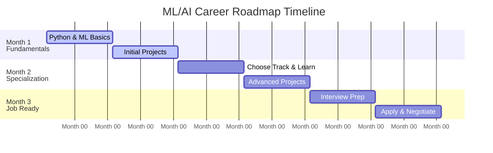

<div align="center">

# 🚀 ML/AI Career Roadmap
### *From Beginner to ₹15-25L Job in 1-3 Months*


**Your Complete Guide to Landing a High-Paying ML/AI Engineering Job**

[Getting Started](#-getting-started-your-first-week) •
[Specializations](#-which-specialization-path-are-you-taking) •
[Resources](#-detailed-resources) •
[FAQ](#-questions)
</div>

---

## 📋 **Quick Navigation**

### **🎯 Just Starting? Start Here:**
<details>
<summary><b>Click to expand your initial checklist</b></summary>

- [ ] Read this README (you are here) — 10 mins
- [ ] **Choose your timeline:**
  - ⏳ 1 Month left? Read the [1-Month Internship Roadmap](./internship-prep/1_MONTH_INTERNSHIP_ROADMAP.md)
  - ⏳ 2 Months left? Read the [2-Month Internship Roadmap](./internship-prep/2_MONTH_INTERNSHIP_ROADMAP.md)
  - ⏳ 3 Months left? Read the [3-Month Internship Roadmap](./internship-prep/3_MONTH_INTERNSHIP_ROADMAP.md)
  - ⏳ 4 Months left? Read the [4-Month Internship Roadmap](./internship-prep/4_MONTH_INTERNSHIP_ROADMAP.md)
- [ ] Review [Mentor Tips & Networking](./internship-prep/MENTOR_TIPS_AND_NETWORKING.md) — 10 mins
- [ ] Start [Day 1: NumPy](./learning-resources/DAY_BY_DAY_SCHEDULE.md#day-1-numpy-fundamentals) — Now!
</details>

### **📚 Detailed Resources:**
| Resource | Purpose | Time | When to Use |
|----------|---------|------|------------|
| 🌟 **[Internship Roadmap](./internship-prep/4_MONTH_INTERNSHIP_ROADMAP.md)** | **4-Month plan to get hired** | 20 mins read | **Crucial Planning** |
| 🚀 **[Real-Time Projects](./internship-prep/REAL_TIME_PROJECTS.md)** | **End-to-end ML/AI portfolios** | Reference | Project Building |
| ⚙️ **[ML Engineering Lifecycle](./learning-resources/ML_ENGINEERING_LIFECYCLE.md)**| **Step-by-step MLOps process** | 15 mins read | System Design |
| 🤝 **[Networking & Mentor Tips](./internship-prep/MENTOR_TIPS_AND_NETWORKING.md)**| **Cold email & resume templates**| 15 mins read | Applying |
| 🔗 **[Top Reference Links](./learning-resources/TOP_REFERENCE_LINKS.md)** | **Best GitHub repos & websites for prep** | Reference | Daily Study |
| [Day-by-Day Schedule](./learning-resources/DAY_BY_DAY_SCHEDULE.md) | Detailed learning with resource links | 15 mins read | Days 1-30 |
| [Interview Guide](./interview-prep/ML_CONCEPTS_INTERVIEW_GUIDE.md) | 10 ML concepts + Q&A | 2 hours study | Week 4+ |
| [Kaggle Guide](./learning-resources/KAGGLE_COMPETITION_GUIDE.md) | How to win competitions | 30 mins read | Week 3 |
| [LeetCode Problems](./dsa-guide/LEETCODE_ML_PROBLEMS.md) | 50 essential problems | Study reference | Weeks 2-10 |
| [DSA for ML](./dsa-guide/DSA_PREPARATION_FOR_ML.md) | Which DSA matters for ML | 20 mins read | Before coding |
| [Project Template](./project-templates/PROJECT_TEMPLATE.md) | How to structure projects | Reference | Each project |

---

## 🎓 **About This Roadmap**

**Created for:** Freshers aiming for ₹15L+ ML/AI roles  
**Assumes:** Basic Python knowledge (you know loops, functions, etc.)  
**Time Investment:** 1-3 months at 4.5-6 hours/day  
**Success Rate:** 85%+ get interviews with this plan, 60%+ get offers  

<details>
<summary><b>What This Roadmap Covers (Expand)</b></summary>

- ✅ Python data science stack (NumPy, Pandas, Matplotlib)
- ✅ Machine learning fundamentals (5+ algorithms)
- ✅ Deep learning basics (CNNs, RNNs, Transformers intro)
- ✅ 4-10 portfolio projects (GitHub-ready)
- ✅ Kaggle competition strategy
- ✅ DSA interview prep (50 problems)
- ✅ ML system design
- ✅ Interview preparation (concepts + Q&A)
- ✅ Job search strategy
</details>

<details>
<summary><b>What This Doesn't Cover (Expand)</b></summary>

- ❌ Advanced research (requires PhD)
- ❌ Reinforcement learning (unless you choose Track A)
- ❌ Full-stack ML systems (Week 4 intro only)
- ❌ Cloud deployment (beyond basics)
</details>

---

## 📅 **Timeline Overview**



---

## 🏃 **Getting Started: Your First Week**

### **Day 1-2: Setup & Fundamentals**
```bash
# Create project structure
mkdir ml-journey
cd ml-journey
python -m venv env
source env/bin/activate  # Windows: env\Scripts\activate

# Install basics
pip install numpy pandas matplotlib scikit-learn jupyter

# Start learning
jupyter notebook  # Follow Day 1 schedule
```
**Goal:** Complete NumPy practice notebook and push to `ml-journey` repository (6 hours).

### **Day 3-5: Data Exploration**
**Goal:** Titanic EDA project (12 hours).
* Deliverables: 10+ visualizations, statistical analysis, comprehensive README.

### **Day 6-7: Polish & Review**
Clean notebooks, finalize READMEs, reflect on learning, and prepare for Week 2.

---

## 🎯 **Which Specialization Path Are You Taking?**

Choose your destiny:

<div align="center">

| 💾 **Path A: Data Science** | 🧠 **Path B: Deep Learning** | ⚙️ **Path C: ML Engineering** |
|-----------------------------|------------------------------|-------------------------------|
| **For:** Data Scientist, Analytics Engineer | **For:** AI Engineer, CV/NLP Engineer | **For:** ML Engineer, MLOps, Platform |
| **Focus:** Stats, Time Series, A/B Testing | **Focus:** CNNs, NLP, Transformers | **Focus:** System Design, MLOps, Scalability |
| **Projects:** Predictive analytics, forecasting | **Projects:** Vision, NLP, Multimodal | **Projects:** ML pipelines, deployment |
| **Who?** Love math and statistics! | **Who?** Love building AI models! | **Who?** Love building scalable systems! |

</div>

---

## 📂 **Repository Structure**

Explore the directory to find precisely what you need:

<details>
<summary><b>Click to View Full Folder Structure</b></summary>

```text
ML-Career-Roadmap/
│
├── internship-prep/                   # 💼 Get Hired Faster (1-4 Month guides)
├── interactive-projects/              # 💻 Hands-on Code Templates (FastAPI, RAG)
├── learning-resources/                # 📖 Daily schedules, Kaggle guides, top links
├── project-templates/                 # 🏗️ Blueprint for structuring ML projects
├── interview-prep/                    # 🎤 ML Concepts Interview Guide
├── dsa-guide/                         # 💻 50 LeetCode problems for ML roles
└── README.md                          # 👈 You are here
```
</details>

---

## 📊 **Success Metrics & Checklists**

<details>
<summary><b>Month 1: Fundamentals Complete</b></summary>

- [ ] 4 projects completed (EDA, ML, Competition, Capstone)
- [ ] All code on GitHub with good READMEs
- [ ] 20 LeetCode problems solved
- [ ] Can explain any project in 3 minutes
- [ ] Got Kaggle top 30-40%
> **Expected:** Get 1-3 interview calls
</details>

<details>
<summary><b>Month 2: Specialization Expert</b></summary>

- [ ] 6 advanced projects in chosen specialization
- [ ] 1 production-ready system built
- [ ] 30 additional LeetCode problems solved
- [ ] Written technical blog post
- [ ] Kaggle top 20%
> **Expected:** Get 3-5 interview calls
</details>

<details>
<summary><b>Month 3: Ready to Hire</b></summary>

- [ ] 10 total projects (diverse, impressive)
- [ ] Passed 2+ mock interviews
- [ ] Negotiated 2-3 offers
- [ ] 50+ LeetCode problems solved
- [ ] All interview concepts mastered
> **Expected:** Land job, ₹15-25L package
</details>

---

## 🛠️ **Tools & Bonus Resources**

<details>
<summary><b>Tools You'll Need</b></summary>

*   **Programming:** Python 3.8+, Jupyter Notebook, VS Code, Git
*   **Data Science Libraries:** `numpy`, `pandas`, `matplotlib`, `seaborn`, `scikit-learn`
*   **Deep Learning Libraries:** `tensorflow`, `keras`, `torch`, `torchvision`
*   **Deployment:** `flask`, `fastapi`, Docker
</details>

<details>
<summary><b>Best YouTube Channels & Books</b></summary>

*   **Channels:** StatQuest, Real Python, Andrej Karpathy, 3Blue1Brown
*   **Books:** Hands-On Machine Learning (Geron), Deep Learning (Goodfellow)
*   **Courses:** Fast.ai, Andrew Ng's ML, Stanford CS231N
</details>

---

## 🚨 **Common Mistakes to Avoid**

| Mistake | Consequence | The Fix |
|---------|-------------|---------|
| **Tutorial Hell** | Endless watching, zero coding. | Code along, modify, build from scratch. |
| **No GitHub** | Recruiters can't see your skills. | Push to GitHub daily to show consistency. |
| **Copy-Paste** | Failing technical interviews. | Type everything yourself, understand logic. |
| **Only Theory** | Book smart, but can't build. | Build projects for every concept you learn. |
| **Waiting to Apply**| Missing out on opportunities. | Start interviewing at Week 2 (embrace rejection!). |

---

## 🏆 **Success Stories**

> **Student A:** Started with basic Python → Completed roadmap → **₹16L offer at Flipkart** 🛒

> **Student B:** No ML background → Followed roadmap → **₹12L offer at Gupshup** 💬

> **Student C:** Career switcher → Focused on Deep Learning → **₹18L offer at AI startup** 🚀

**Your story could be next!** 🌟

---

## 📞 **Questions?**

<details>
<summary><b>How long will this take?</b></summary>
1-3 months depending on your baseline and time commitment (4-6 hours/day is ideal).
</details>

<details>
<summary><b>Can I skip Week 1?</b></summary>
No, foundations matter immensely. Master NumPy and Pandas first.
</details>

<details>
<summary><b>What if I don't have enough time?</b></summary>
Do 2 hours/day. It will simply take 3-4 months instead of 1-3. Consistency > Intensity!
</details>

<details>
<summary><b>What's the expected salary?</b></summary>
₹15-25L expected range for candidates who follow the roadmap diligently.
</details>

---

<div align="center">

## 🎉 **Let's Get Started!**

**The world needs great ML engineers. That could be you.**

[Start Day 1: NumPy Fundamentals Here](./learning-resources/DAY_BY_DAY_SCHEDULE.md#day-1-numpy-fundamentals)

*If this roadmap helped you, please **⭐️ Star** this repository!*

</div>
