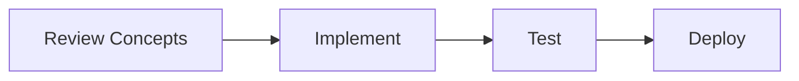

> [!TIP]
> **Document Workflow**

🚀 # 🧠 The Topic-Based ML Roadmap
🔍 ### *Learn at Your Own Pace, Master the Fundamentals*

Every student learns at a different speed. Rigid "1-month" or "3-month" schedules often cause burnout or boredom. This roadmap is strictly **Topic-Based**. You only move to the next level when you have mastered the current one. 

Use the **Self-Assessment** in the main README to figure out exactly which Level you should start at.

---

✨ ## 🟢 Level 0: Python & Math Foundations
*The absolute prerequisites. Do not skip this if you are a beginner.*

🔍 ### Core Topics:

<b>1. Python Programming Basics</b>

*   **Data Types & Structures:** Strings, Lists, Tuples, Sets, Dictionaries.
*   **Control Flow:** If/else, For loops, While loops, List Comprehensions.
*   **Functions & Modules:** Lambda functions, `*args`, `**kwargs`, writing clean functions.
*   **Object-Oriented Programming (OOP):** Classes, Objects, Inheritance, Methods (Dunder methods).

<b>2. Linear Algebra Review (Andrew Ng - Week 1)</b>

*   Matrices and Vectors
*   Addition, Scalar Multiplication, and Matrix-Vector Multiplication
*   Properties of Matrix Multiplication, Inverse, and Transpose

<b>3. Calculus & Probability Basics</b>

*   **Calculus:** Derivatives, Chain Rule, Gradients (understanding *why* things optimize).
*   **Probability:** Mean, Median, Variance, Standard Deviation, Normal Distribution, Bayes' Theorem.

🔍 ### Action Items & Verification:
- [ ] Watch a 4-hour Python crash course (e.g., Programming with Mosh or FreeCodeCamp).
- [ ] Watch 3Blue1Brown's "Essence of Linear Algebra" series on YouTube.
- **Proof of Mastery:** You can write a Python script that reads a text file, counts the frequency of each word, and prints the top 10 most common words using a dictionary.

---

✨ ## 🟡 Level 1: Data Manipulation & EDA
*Data Scientists spend 80% of their time here.*

🔍 ### Core Topics:

<b>1. NumPy (Numerical Python)</b>

*   Array Creation (1D, 2D, 3D Tensors).
*   Indexing, Slicing, and Reshaping.
*   Broadcasting and Vectorized Operations (no `for` loops!).
*   Linear Algebra operations (`np.dot`, `np.linalg`).

<b>2. Pandas (Data Manipulation)</b>

*   **Series & DataFrames:** Creation, reading CSVs/Excel/SQL.
*   **Indexing:** `loc` vs `iloc`, Boolean indexing.
*   **Data Cleaning:** Handling Missing Values (`fillna`, `dropna`), Duplicates.
*   **Transformations:** `apply`, `map`, `replace`.
*   **Aggregations:** `groupby`, `pivot_table`, MultiIndex.
*   **Combining Data:** Merging, Joining, and Concatenating DataFrames.

<b>3. Data Visualization</b>

*   **Matplotlib:** Object-oriented API (Figures & Axes), Line plots, Scatter plots, Subplots.
*   **Seaborn:** Statistical plots (Box plots, Violin plots, Pair plots, Correlation Heatmaps).
*   **Interactive (Optional):** Plotly or Altair basics.

<b>4. SQL for Data Science</b>

*   **Basics:** SELECT, WHERE, ORDER BY, LIMIT.
*   **Aggregations:** GROUP BY, HAVING, COUNT, SUM, AVG.
*   **Joins:** INNER JOIN, LEFT JOIN, FULL OUTER JOIN.
*   **Advanced:** Common Table Expressions (CTEs), Window Functions (`RANK()`, `OVER()`).

🔍 ### Action Items & Verification:
- [ ] Complete Kaggle's free "Pandas" and "Data Visualization" micro-courses.
- **Proof of Mastery:** Download the "Titanic" dataset from Kaggle. Perform Exploratory Data Analysis (EDA) in a Jupyter Notebook. Create 5 distinct charts that explain survival demographics.

---

✨ ## 🟠 Level 2: Classical Machine Learning
*The core algorithms. Do not jump to Deep Learning before mastering these.*

🔍 ### Core Topics (Andrew Ng Syllabus Integration):

<b>1. Introduction & Linear Regression (Weeks 1-2)</b>

*   What is Machine Learning? (Supervised vs Unsupervised)
*   Model Representation & Cost Function
*   Gradient Descent (Intuition and Linear Regression implementation)
*   Multivariate Features & Polynomial Regression
*   Feature Scaling & Learning Rate Adjustment
*   Normal Equation

<b>2. Classification & Regularization (Week 3)</b>

*   **Logistic Regression:** Decision Boundaries, Cost Function, Multi-class (One-vs-All)
*   **Regularization:** The problem of Overfitting, Regularized Linear/Logistic Regression

<b>3. System Design & Best Practices (Week 6)</b>

*   Evaluating a Hypothesis (Train/Validation/Test Sets)
*   Diagnosing Bias vs. Variance
*   Learning Curves
*   Error Analysis & Metrics for Skewed Classes (Precision vs Recall)

<b>4. Advanced Classifiers & Unsupervised Learning (Weeks 7-9)</b>

*   **Support Vector Machines (SVM):** Large Margin Intuition, Kernels
*   **Clustering:** K-Means Algorithm, Random Initialization, Choosing Cluster Count
*   **Dimensionality Reduction (PCA):** Data Compression & Visualization
*   **Anomaly Detection:** Gaussian Distribution, Algorithm Evaluation
*   **Recommender Systems:** Content-Based, Collaborative Filtering, Matrix Factorization

🔍 ### Action Items & Verification:
- [ ] Follow the free "Machine Learning" course by Andrew Ng (Coursera).
- [ ] Read the official Scikit-Learn documentation tutorials.
- **Proof of Mastery:** Build an End-to-End model predicting House Prices or Customer Churn. Use Scikit-Learn `Pipeline` and `ColumnTransformer` to handle missing data and categorical encoding.

---

✨ ## 🔴 Level 3: Deep Learning & AI
*For Computer Vision, Natural Language Processing, and Complex Patterns.*

🔍 ### Core Topics:

<b>1. Neural Networks: Representation & Learning (Andrew Ng - Weeks 4-5)</b>

*   Non-linear Hypotheses & Neurons
*   Forward Propagation & Cost Function
*   Backpropagation Algorithm & Gradient Checking
*   Random Initialization

<b>2. Deep Learning Frameworks (PyTorch)</b>

*   Tensors and Autograd (Automatic Differentiation).
*   Building Custom `Dataset` and `DataLoader` classes.
*   Writing Custom Training Loops (Zeroing gradients, backward pass, optimizer step).
*   Saving and Loading model checkpoints (`.pth`).

<b>3. Computer Vision (CV)</b>

*   Convolutional Neural Networks (CNNs), Padding, Strides, Max Pooling.
*   Famous Architectures: ResNet, VGG, Inception.
*   Transfer Learning and Fine-tuning.
*   Advanced (Optional): Object Detection (YOLO) and Image Segmentation (U-Net).

<b>4. Natural Language Processing (NLP) & LLMs</b>

*   **Text Processing:** Tokenization, Stemming, Lemmatization.
*   **Word Embeddings:** Word2Vec, GloVe.
*   **Sequence Models:** RNNs, LSTMs, GRUs.
*   **Transformers (The Modern Era):** Self-Attention Mechanism, Multi-Head Attention.
*   **HuggingFace:** Using the `transformers` library, fine-tuning BERT/RoBERTa.
*   **Generative AI:** GPT Architecture basics, Prompt Engineering, RAG (Retrieval-Augmented Generation) with LangChain/LlamaIndex.

🔍 ### Action Items & Verification:
- [ ] Take the Fast.ai course "Practical Deep Learning for Coders".
- [ ] Watch Andrej Karpathy's "Neural Networks: Zero to Hero" series on YouTube.
- **Proof of Mastery:** Fine-tune a pre-trained Image Classification model (like ResNet50) to classify images, OR fine-tune a HuggingFace Transformer model for sentiment analysis.

---

✨ ## ⚫ Level 4: MLOps & Production Engineering
*The skills that get you hired as a Senior ML Engineer for ₹15L - ₹25L.*

🔍 ### Core Topics:

<b>1. Optimization & Large Scale ML (Andrew Ng - Week 10)</b>

*   Stochastic Gradient Descent (SGD) & Mini-Batch.
*   Online Learning.
*   Data Parallelism (MapReduce/Spark basics).

<b>2. Experiment Tracking & Versioning</b>

*   **Git & GitHub:** Branching, Pull Requests, Merge Conflicts.
*   **DVC (Data Version Control):** Versioning large `.csv` and `.jpg` datasets alongside Git.
*   **MLflow / Weights & Biases:** Logging hyperparameters, tracking metrics (loss/accuracy curves), and Model Registry.

<b>3. Model Serving & API Development</b>

*   **FastAPI:** Building highly performant REST APIs.
*   **Pydantic:** Validating incoming JSON requests to prevent API crashes.
*   Loading serialized models (`.pkl`, `.onnx`, `.pt`) safely in memory.

<b>4. Containerization & Orchestration</b>

*   **Docker:** Writing optimized `Dockerfile`s for Python/ML (multi-stage builds, minimizing image size).
*   **Docker Compose:** Spinning up multi-container applications (e.g., API + MLflow server + Database).

<b>5. CI/CD & Production Monitoring</b>

*   **GitHub Actions:** Writing YAML workflows to automatically run `pytest` and linting on every push.
*   **Monitoring (Evidently AI):** Detecting Data Drift (input features changing over time) and Concept Drift (model degrading).
*   **Alerting:** Setting up automated retraining pipelines.

🔍 ### Action Items & Verification:
- [ ] Study our very own **[MLOps Reference Project](../mlops-reference-project/README.md)**.
- [ ] Study our **[ML Engineering Reference Project](../ml-engineer-reference-project/README.md)**.
- **Proof of Mastery:** Take the model you built in Level 2 or 3. Track its training with MLflow. Wrap it in a FastAPI endpoint. Write a Dockerfile for it. Push it to GitHub and set up an Action that runs `pytest` on your code.

---

✨ ## 🔗 Top Recommended Open Source References
Use these world-class GitHub repositories alongside the roadmap to accelerate your learning:
*   🌟 [fengdu78/Coursera-ML-AndrewNg-Notes](https://github.com/fengdu78/Coursera-ML-AndrewNg-Notes) - Comprehensive translated notes.
*   🌟 [kaleko/CourseraML](https://github.com/kaleko/CourseraML) - Python implementations of assignments.
*   🌟 [Yorko/mlcourse.ai](https://github.com/Yorko/mlcourse.ai) - Incredible open ML course.
*   🌟 [dair-ai/ML-YouTube-Courses](https://github.com/dair-ai/ML-YouTube-Courses) - Curated directory of ML video courses.
*   🌟 [ashishtele/Quick-Notes-for-ML-DS](https://github.com/ashishtele/Quick-Notes-for-ML-DS) - High-quality quick reference notes.
*   🌟 [prathimacode-hub/ML-ProjectKart](https://github.com/prathimacode-hub/ML-ProjectKart) - Massive collection of ML projects.

> **Note on Study Groups:** If studying with the Chinese-speaking community, join ML QQ group: `955171419` *(Do not join multiple groups to leave space for others!)*.

---

✨ ## ⏭️ Next Steps

Once you complete **Level 4**, you are fully prepared for ML Engineering interviews. 
*   Review the [ML Concepts Interview Guide](../interview-prep/ML_CONCEPTS_INTERVIEW_GUIDE.md).
*   Practice coding questions in the [DSA for ML Guide](../dsa-guide/DSA_PREPARATION_FOR_ML.md).
*   Apply for jobs!

<!-- Formatting improvements -->

---
*🎯 **Pro Tip**: Consistency is key in Machine Learning. Keep building and exploring!*