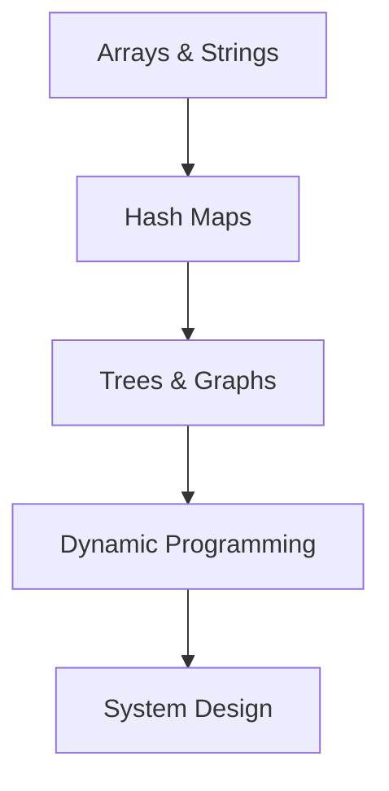

🚀 # DSA Preparation Guide for ML/AI Engineer Roles

> [!TIP]
> **DSA Preparation Roadmap for ML**




**Key Insight:** Most ML roles don't require hardcore DSA, BUT you need practical DSA for system design and coding interviews.

---

✨ ## **Why DSA Matters for ML Roles**

| Role | DSA Importance | Why |
|------|----------------|-----|
| ML Engineer | 🔴 High (80%) | Need to design systems, optimize code, handle scale |
| Data Scientist | 🟡 Medium (50%) | Focus more on ML, less on systems |
| Data Engineer | 🔴 Very High (90%) | Heavy systems, optimization, data structures |
| Research Scientist | 🟢 Low (20%) | Focus on math/algorithms, not coding |
| Analytics Engineer | 🟢 Low (30%) | Focus on SQL, not DSA |

---

✨ ## **DSA for Different ML Interview Types**

🔍 ### **Type 1: ML Engineer Interview** 
```
DSA Component: 30-40%
├─ System Design (ML system): 30%
├─ Coding round: 30%
├─ ML concepts: 20%
└─ Behavioral: 20%

Key Topics: Data structures, optimization, scalability
```

🔍 ### **Type 2: Data Scientist Interview**
```
DSA Component: 10-20%
├─ Coding round (easy-medium): 20%
├─ ML problems: 40%
├─ Statistics: 20%
└─ Behavioral: 20%

Key Topics: Basic data structures, simple problems
```

🔍 ### **Type 3: System Design Interview**
```
DSA Component: 50%
├─ System design: 50%
├─ Scalability considerations: 30%
├─ Trade-offs: 20%

Key Topics: Architecture, databases, caching
```

---

✨ ## **Minimum DSA Requirements by Role**

🔍 ### **For ML Engineer: 60-80% DSA Focus**

**Must Know:**
- [ ] Hash maps & sets
- [ ] Heaps & priority queues
- [ ] Trees (BST, balanced trees)
- [ ] Graphs (DFS, BFS, shortest path)
- [ ] Dynamic programming basics
- [ ] Sorting & searching

**Nice to Know:**
- [ ] Advanced trees (Red-Black, AVL)
- [ ] Segment trees
- [ ] Tries
- [ ] Union-Find

**Problems to Solve:**
- 50-70 medium problems
- Focus on: Optimization, efficiency
- Time limit: 40-45 mins per problem

---

🔍 ### **For Data Scientist: 30-40% DSA Focus**

**Must Know:**
- [ ] Hash maps & sets
- [ ] Lists & arrays
- [ ] Basic sorting
- [ ] Simple recursion

**Nice to Know:**
- [ ] Trees basics
- [ ] Simple graphs
- [ ] Binary search

**Problems to Solve:**
- 20-30 easy-to-medium problems
- Focus on: Understanding concepts
- Time limit: 50-60 mins per problem (no pressure)

---

🔍 ### **For Data Engineer: 80-90% DSA Focus**

**Must Know:**
- Everything for ML Engineer
- [ ] Advanced databases
- [ ] Distributed systems concepts
- [ ] Message queues
- [ ] Stream processing

**Nice to Know:**
- [ ] Advanced algorithms
- [ ] Distributed algorithms
- [ ] Consensus mechanisms

**Problems to Solve:**
- 70-100 medium-to-hard problems
- Focus on: Optimization, scale
- Time limit: 35-40 mins per problem

---

✨ ## **Tailored Study Plan by Role**

🔍 ### **Plan A: ML Engineer (8 weeks)**

**Week 1-2: Fundamentals**
- Hash maps & sets (3h)
- Arrays & lists (3h)
- Sorting (2h)
- 10 problems

**Week 3-4: Data Structures**
- Stacks & queues (2h)
- Heaps & priority queues (3h)
- Trees & BST (4h)
- 15 problems (focus on optimization)

**Week 5-6: Graphs**
- DFS & BFS (3h)
- Shortest path (Dijkstra, Bellman-Ford) (3h)
- Topological sort (2h)
- 12 problems

**Week 7: System Design Patterns**
- Caching strategies (2h)
- Load balancing (2h)
- Database indexing (2h)
- 5 design problems

**Week 8: Mock Interviews & Practice**
- Timed coding rounds (5 problems, 40 mins each)
- System design practice (3 problems)

**Total:** 50-55 medium-level problems

---

🔍 ### **Plan B: Data Scientist (5 weeks)**

**Week 1: Basics**
- Arrays & lists (2h)
- Hash maps (2h)
- Sorting (1h)
- 8 problems (easy)

**Week 2-3: Foundations**
- Recursion & backtracking (2h)
- Simple graphs (2h)
- Binary search (1h)
- 12 problems (easy-to-medium)

**Week 4: Problem-Solving Practice**
- Focus on understanding, not speed
- 10 problems (your choice of difficulty)

**Week 5: Mock & Review**
- Practice problems (5)
- Review weak areas

**Total:** 25-30 problems (mostly easy)

---

🔍 ### **Plan C: Data Engineer (10 weeks)**

**Week 1-2: Strong Fundamentals**
- Hash maps, arrays, sorting (6h)
- 12 problems

**Week 3-5: Advanced Structures**
- Trees, heaps, graphs (12h)
- 25 problems (focus on efficiency)

**Week 6-7: Optimization**
- DP, greedy algorithms (6h)
- 15 problems (hard/optimization)

**Week 8-9: System Design**
- Distributed systems concepts (8h)
- 8 design problems

**Week 10: Practice & Mock**
- Full mock interviews (5 rounds)
- 10 final problems

**Total:** 70+ problems

---

✨ ## **Practical DSA for ML-Specific Scenarios**

🔍 ### **Scenario 1: Real-Time Prediction System**

**DSA Needed:**
- Hash maps for caching
- Heaps for priority (urgent requests)
- Queues for buffering
- Graphs for feature dependencies

**Example Problem:** Design LRU cache for model predictions
```python
🚀 # Why? Model predictions take time
🚀 # Solution: Cache recent predictions using LRU eviction
🚀 # DSA: LinkedList + HashMap (LRU cache pattern)
```

---

🔍 ### **Scenario 2: Feature Engineering Pipeline**

**DSA Needed:**
- Efficient sorting
- Hash maps for deduplication
- Trees for feature hierarchies
- Tries for string features

**Example Problem:** Deduplicate and sort 1M feature vectors
```python
🚀 # Why? Need efficiency for 1M+ features
🚀 # Solution: Hash map for dedup, sorted heap for top-k
🚀 # DSA: Hash map + Heap
```

---

🔍 ### **Scenario 3: Model Training at Scale**

**DSA Needed:**
- Graphs for computation DAGs
- Priority queues for job scheduling
- Trees for decision trees
- Arrays for matrix operations

**Example Problem:** Schedule ML training jobs with dependencies
```python
🚀 # Why? Jobs have dependencies (data preprocessing → feature eng → training)
🚀 # Solution: Topological sort of job DAG
🚀 # DSA: Directed graph + DFS/topological sort
```

---

🔍 ### **Scenario 4: Recommendation System**

**DSA Needed:**
- Heaps for top-k recommendations
- Hash maps for user-item lookup
- Trees for hierarchical categories
- Graphs for user similarity

**Example Problem:** Find top-10 recommendations for user
```python
🚀 # Why? Efficiently find top-k from millions
🚀 # Solution: Use heap-based selection
🚀 # DSA: Heap (priority queue)
```

---

🔍 ### **Scenario 5: Data Processing Pipeline**

**DSA Needed:**
- Stacks/queues for order processing
- Trees for hierarchical data
- Hash maps for aggregation
- Graphs for data lineage

**Example Problem:** Process streaming data and detect anomalies
```python
🚀 # Why? Need efficient windowing and aggregation
🚀 # Solution: Sliding window with heap/deque
🚀 # DSA: Deque + Heap
```

---

✨ ## **Common ML System Design Patterns (DSA-Heavy)**

🔍 ### **Pattern 1: Caching Layer**
```
Problem: Model predictions are slow (inference takes 100ms)
Solution: Cache recent predictions
DSA: LRU Cache (LinkedList + HashMap)
Complexity: O(1) get/put
```

🔍 ### **Pattern 2: Priority Processing**
```
Problem: Handle urgent requests first
Solution: Priority queue for requests
DSA: Max/Min Heap
Complexity: O(log n) insert/remove
```

🔍 ### **Pattern 3: Feature Aggregation**
```
Problem: Aggregate features from multiple sources
Solution: Efficient merging and deduplication
DSA: Sorted arrays, merge operation
Complexity: O(n log n)
```

🔍 ### **Pattern 4: Dependency Management**
```
Problem: Features depend on other features
Solution: Manage computation order
DSA: DAG + Topological sort
Complexity: O(V + E)
```

🔍 ### **Pattern 5: Similarity Search**
```
Problem: Find similar items from millions
Solution: Efficient search structure
DSA: KD-tree or Locality Sensitive Hashing
Complexity: O(log n) with LSH, O(d log n) with KD-tree
```

---

✨ ## **DSA Topics by Importance for ML Roles**

🔍 ### **Critical (Must Master: 100%)**
1. Hash maps / Hash sets
   - Why: Deduplication, lookups, caching
   - Problems: 5-8

2. Arrays / Lists
   - Why: Data structure foundation
   - Problems: 5-8

3. Sorting
   - Why: Data preprocessing
   - Problems: 3-5

4. Graphs (DFS, BFS)
   - Why: Feature dependencies, recommendation systems
   - Problems: 8-12

5. Heaps / Priority Queues
   - Why: Top-k selection, scheduling
   - Problems: 5-8

🔍 ### **Important (Should Master: 80%)**
6. Trees (BST, balanced)
   - Why: Decision trees, search
   - Problems: 8-10

7. Binary Search
   - Why: Efficient searching
   - Problems: 3-5

8. Dynamic Programming (basics)
   - Why: Optimization
   - Problems: 5-8

9. Stacks / Queues
   - Why: Order processing, buffering
   - Problems: 3-5

🔍 ### **Nice-to-Have (Could Learn: 50%)**
10. Advanced trees (Tries, Segment trees)
    - Problems: 2-3

11. Union-Find
    - Problems: 1-2

12. Topological Sort
    - Problems: 2-3

---

✨ ## **Mock Interview Simulation**

🔍 ### **ML Engineer Interview**

**Round 1: Coding (45 mins)**
```
Problem: LRU Cache
Difficulty: Medium
Time limit: 45 mins
Expected: Optimal solution with O(1) ops

Why? Practical for caching predictions
```

**Round 2: System Design (60 mins)**
```
Problem: Design recommendation system at scale
Components:
- Data ingestion (handle 1M+ events/sec)
- Feature engineering (fast computation)
- Model serving (low latency)
- Monitoring

Why? All three use DSA: Graphs, Heaps, Hashing
```

---

🔍 ### **Data Scientist Interview**

**Round 1: Coding (30 mins)**
```
Problem: Two Sum or simple array manipulation
Difficulty: Easy to Medium
Time limit: 30 mins
Expected: Working solution

Why? DSA is secondary, ML is primary
```

**Round 2: ML Problem (60 mins)**
```Problem: Predict customer churn
- Understand data
- Build model
- Evaluate
- Improve

DSA needed: Maybe sorting, grouping (hash map)
```

---

✨ ## **Study Tips Specific to ML**

🔍 ### **Tip 1: Connect to ML Problems**
When learning DSA, think: "How would I use this in ML?"

Example:
- Learning Heap? → Think "top-k recommendation"
- Learning DFS? → Think "dependency resolution"
- Learning DP? → Think "sequence optimization"

🔍 ### **Tip 2: Focus on Patterns, Not Memorization**
- Don't memorize solutions
- Learn patterns (sliding window, two pointers, DFS, etc.)
- Apply patterns to new problems

🔍 ### **Tip 3: Solve Problems in ML Context**
- When solving array problem, think of it as feature vector
- When solving graph problem, think of it as dependency graph
- When solving DP problem, think of it as optimization problem

🔍 ### **Tip 4: Time Yourself**
- Easy: 20-25 mins (target)
- Medium: 40-45 mins (target)
- Hard: 50-60 mins (target)

**In interview, you should be 10-15% faster**

🔍 ### **Tip 5: Practice Edge Cases**
For ML context:
- Empty dataset (edge case: empty array)
- Single sample (edge case: single element)
- Extremely large dataset (edge case: large input)
- Duplicate values (edge case: duplicate handling)
- Special values (NaN, Inf in ML context)

---

✨ ## **DSA Topics Ranked by ML Relevance**

| Rank | Topic | Importance | ML Use Case |
|------|-------|-----------|------------|
| 1 | Hash map/set | 🔴 Critical | Caching, deduplication |
| 2 | Arrays | 🔴 Critical | Feature vectors, data |
| 3 | Sorting | 🔴 Critical | Data preprocessing |
| 4 | Heap/Priority Queue | 🔴 Critical | Top-k, scheduling |
| 5 | Graphs (DFS/BFS) | 🔴 Critical | Dependencies, similarity |
| 6 | Binary Search | 🟠 High | Efficient searching |
| 7 | Trees | 🟠 High | Decision trees, indexing |
| 8 | DP | 🟠 High | Optimization problems |
| 9 | Stacks/Queues | 🟡 Medium | Order processing |
| 10 | Tries | 🟡 Medium | String processing, NLP |
| 11 | Union-Find | 🟡 Medium | Graph connectivity |
| 12 | Segment Trees | 🟢 Low | Range queries |
| 13 | Advanced DP | 🟢 Low | Complex optimization |
| 14 | Math tricks | 🟢 Low | Competitive programming |

---

✨ ## **Quick Reference: DSA Interview Checklist**

- [ ] Can solve 5 easy problems in 20 mins each
- [ ] Can solve 10 medium problems in 40 mins each
- [ ] Can design system using DSA concepts (60 mins)
- [ ] Know time/space complexity of every solution
- [ ] Can explain trade-offs between approaches
- [ ] Can optimize solution from O(n²) to O(n)
- [ ] Can write clean, production-ready code
- [ ] Can handle edge cases properly

---

✨ ## **Final Notes**

**If Time Constraint:**
1. Skip topics: Advanced trees, segment trees, math tricks
2. Focus on: Hash maps, arrays, sorting, graphs, heaps
3. Solve: 25-30 core problems
4. Target: Top 50% of interviews

**If You Have Time:**
1. Cover all topics
2. Solve: 50-70 problems
3. Target: Top 25% of interviews

**Remember:** For ML roles, DSA is a gate (you need minimum competency), not the main game. The main game is ML knowledge + system design!

---

**You've got this! Practice consistently, and the rest will follow.** 🚀

<!-- Formatting improvements -->


---
*🎯 **Pro Tip**: Consistency is key in Machine Learning. Keep building and exploring!*