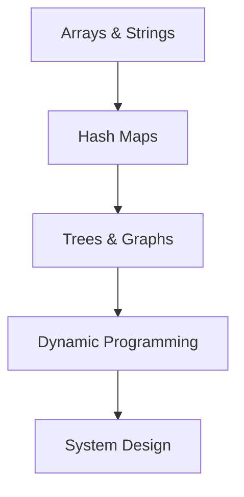

🚀 # LeetCode Problems for ML/AI Engineer Roles

> [!TIP]
> **DSA Preparation Roadmap for ML**




**Goal:** 50+ problems across all difficulty levels
**Timeline:** Solve 5-10 per week
**Focus:** Practical problems relevant to ML engineering

---

✨ ## **Problem Categories**

🔍 ### **Category 1: Arrays & Strings (10 problems)** — Most Common

**Easy (3 problems):**
1. **Two Sum** (Medium to Easy ratio)
   - LeetCode #1
   - Concepts: Hash map, two pointers
   - ML Application: Finding relationships, pairs in data

2. **Best Time to Buy and Sell Stock**
   - LeetCode #121
   - Concepts: Single pass, tracking max/min
   - ML Application: Time series data processing

3. **Contains Duplicate**
   - LeetCode #217
   - Concepts: Hash set, uniqueness
   - ML Application: Data quality checks

**Medium (5 problems):**
4. **Product of Array Except Self**
   - LeetCode #238
   - Concepts: Prefix sum, division-free approach
   - ML Application: Feature normalization

5. **Longest Substring Without Repeating Characters**
   - LeetCode #3
   - Concepts: Sliding window
   - ML Application: Text processing, tokenization

6. **3Sum**
   - LeetCode #15
   - Concepts: Sorting, two pointers, duplicates
   - ML Application: Feature interactions

7. **LRU Cache**
   - LeetCode #146
   - Concepts: Linked list, hash map
   - ML Application: Model inference caching

8. **Rotate Array**
   - LeetCode #189
   - Concepts: Array manipulation, in-place operations
   - ML Application: Time series data preparation

**Hard (2 problems):**
9. **Trapping Rain Water**
   - LeetCode #42
   - Concepts: Optimization, stack
   - ML Application: Feature engineering edge cases

10. **Sliding Window Maximum**
    - LeetCode #239
    - Concepts: Deque, optimization
    - ML Application: Real-time data processing

---

🔍 ### **Category 2: Linked Lists (5 problems)** — Lower Priority for ML

**Easy (2 problems):**
1. **Reverse Linked List** (LeetCode #206)
2. **Merge Two Sorted Lists** (LeetCode #21)

**Medium (3 problems):**
3. **Add Two Numbers** (LeetCode #2)
4. **Linked List Cycle II** (LeetCode #142)
5. **Reorder List** (LeetCode #143)

---

🔍 ### **Category 3: Trees (10 problems)** — Very Important for ML

**Easy (2 problems):**
1. **Binary Tree Traversal** (LeetCode #94, #102, #145)
   - In-order, Level-order, Post-order
   - Concepts: DFS, BFS, Recursion
   - ML Application: Tree-based models, visualization

2. **Invert Binary Tree** (LeetCode #226)
   - Concepts: Tree manipulation
   - ML Application: Model structure transformation

**Medium (6 problems):**
3. **Lowest Common Ancestor** (LeetCode #236)
   - Concepts: Tree traversal, recursion
   - ML Application: Decision tree logic

4. **Level Order Traversal** (LeetCode #102)
   - Concepts: BFS, level-wise processing
   - ML Application: Layer processing in neural networks

5. **Path Sum** (LeetCode #112)
   - Concepts: DFS, backtracking
   - ML Application: Feature path analysis

6. **Maximum Path Sum** (LeetCode #124)
   - Concepts: DP on trees
   - ML Application: Optimization problems

7. **Validate Binary Search Tree** (LeetCode #98)
   - Concepts: BST properties
   - ML Application: Model validation

8. **Binary Tree Maximum Path Sum** (LeetCode #124)
   - Concepts: DFS, tracking maximum
   - ML Application: Feature optimization

**Hard (2 problems):**
9. **Serialize and Deserialize Binary Tree** (LeetCode #297)
   - Concepts: Tree encoding, recursion
   - ML Application: Model serialization

10. **Binary Tree from Preorder and Inorder** (LeetCode #105)
    - Concepts: Tree construction from traversals
    - ML Application: Model reconstruction

---

🔍 ### **Category 4: Graphs (10 problems)** — Important for ML

**Easy (2 problems):**
1. **Number of Islands** (LeetCode #200)
   - Concepts: DFS/BFS, connected components
   - ML Application: Clustering, image segmentation

2. **Valid Parentheses** (LeetCode #20)
   - Concepts: Stack
   - ML Application: Expression parsing

**Medium (6 problems):**
3. **Course Schedule** (LeetCode #207)
   - Concepts: Topological sort, cycle detection
   - ML Application: Dependency resolution

4. **Pacific Atlantic Water Flow** (LeetCode #417)
   - Concepts: DFS, multi-source
   - ML Application: Multi-path analysis

5. **Number of Connected Components** (LeetCode #323)
   - Concepts: Union-Find, BFS
   - ML Application: Community detection

6. **Graph Valid Tree** (LeetCode #261)
   - Concepts: Tree properties, cycle detection
   - ML Application: Model dependency verification

7. **Longest Increasing Path in Matrix** (LeetCode #329)
   - Concepts: DFS, DP, memoization
   - ML Application: Sequence analysis

8. **Clone Graph** (LeetCode #133)
   - Concepts: Graph traversal, deep copy
   - ML Application: Model cloning

**Hard (2 problems):**
9. **Alien Dictionary** (LeetCode #269)
   - Concepts: Topological sort, graph construction
   - ML Application: Feature ordering

10. **Critical Connections in Network** (LeetCode #1192)
    - Concepts: DFS, bridge finding
    - ML Application: Critical path analysis

---

🔍 ### **Category 5: Dynamic Programming (10 problems)** — Essential for ML

**Easy (2 problems):**
1. **Climbing Stairs** (LeetCode #70)
   - Concepts: Simple DP, bottom-up
   - ML Application: Simple optimization

2. **House Robber** (LeetCode #198)
   - Concepts: DP, optimization
   - ML Application: Sequential decision making

**Medium (6 problems):**
3. **Coin Change** (LeetCode #322)
   - Concepts: DP, optimization
   - ML Application: Resource allocation

4. **Longest Increasing Subsequence** (LeetCode #300)
   - Concepts: DP, binary search
   - ML Application: Time series analysis

5. **Word Break** (LeetCode #139)
   - Concepts: DP, string matching
   - ML Application: NLP tokenization

6. **Partition Equal Subset Sum** (LeetCode #416)
   - Concepts: DP, knapsack
   - ML Application: Balanced data splitting

7. **Maximum Product Subarray** (LeetCode #152)
   - Concepts: DP, tracking multiple states
   - ML Application: Feature scaling optimization

8. **Edit Distance** (LeetCode #72)
   - Concepts: DP, string comparison
   - ML Application: NLP similarity metrics

**Hard (2 problems):**
9. **Interleaving String** (LeetCode #97)
   - Concepts: 2D DP
   - ML Application: Sequence alignment

10. **Russian Doll Envelopes** (LeetCode #354)
    - Concepts: DP, binary search
    - ML Application: Nested feature optimization

---

🔍 ### **Category 6: Math & Bit Manipulation (5 problems)** — Lower Priority

**Easy (2 problems):**
1. **Number of 1 Bits** (LeetCode #191)
2. **Hamming Distance** (LeetCode #461)

**Medium (3 problems):**
3. **Divide Two Integers** (LeetCode #29)
4. **Majority Element** (LeetCode #169)
5. **Single Number II** (LeetCode #137)

---

🔍 ### **Category 7: Design & System Design (5 problems)** — Very Important for ML Eng

**Medium (5 problems):**
1. **LRU Cache** (LeetCode #146)
   - Concepts: Design, optimization
   - ML Application: Model caching

2. **Min Stack** (LeetCode #155)
   - Concepts: Stack design
   - ML Application: Efficient monitoring

3. **Implement Trie (Prefix Tree)** (LeetCode #208)
   - Concepts: Trie data structure
   - ML Application: NLP word prediction

4. **Design Add and Search Words Data Structure** (LeetCode #211)
   - Concepts: Trie, regex
   - ML Application: Full-text search

5. **Design Iterator for Linked List** (LeetCode #244)
   - Concepts: Iterator pattern
   - ML Application: Data loader design

---

✨ ## **Study Plan: 50 Problems in 10 Weeks**

🔍 ### **Week 1-2: Arrays & Strings (10 problems)**
- [ ] Two Sum
- [ ] Best Time to Buy Stock
- [ ] Contains Duplicate
- [ ] Product of Array Except Self
- [ ] Longest Substring Without Repeating
- [ ] 3Sum
- [ ] LRU Cache
- [ ] Rotate Array
- [ ] Trapping Rain Water
- [ ] Sliding Window Maximum

**Time:** 5-7 hours
**Focus:** Understand concepts, not memorize solutions

---

🔍 ### **Week 3: Trees Fundamentals (5 problems)**
- [ ] Binary Tree Traversal (all 3 orders)
- [ ] Invert Binary Tree
- [ ] Lowest Common Ancestor
- [ ] Level Order Traversal
- [ ] Path Sum

**Time:** 5 hours

---

🔍 ### **Week 4: Trees Advanced (5 problems)**
- [ ] Maximum Path Sum
- [ ] Validate BST
- [ ] Serialize and Deserialize
- [ ] Binary Tree from Traversals
- [ ] Balanced Binary Tree

**Time:** 5 hours

---

🔍 ### **Week 5: Graphs Basics (5 problems)**
- [ ] Number of Islands
- [ ] Course Schedule
- [ ] Valid Parentheses
- [ ] Pacific Atlantic Water Flow
- [ ] Number of Connected Components

**Time:** 5-6 hours

---

🔍 ### **Week 6: Graphs Advanced (5 problems)**
- [ ] Graph Valid Tree
- [ ] Longest Increasing Path
- [ ] Clone Graph
- [ ] Alien Dictionary
- [ ] Critical Connections

**Time:** 6-7 hours

---

🔍 ### **Week 7: Dynamic Programming Easy (5 problems)**
- [ ] Climbing Stairs
- [ ] House Robber
- [ ] Coin Change
- [ ] Longest Increasing Subsequence
- [ ] Word Break

**Time:** 5-6 hours

---

🔍 ### **Week 8: Dynamic Programming Medium (5 problems)**
- [ ] Partition Equal Subset Sum
- [ ] Maximum Product Subarray
- [ ] Edit Distance
- [ ] Interleaving String
- [ ] Russian Doll Envelopes

**Time:** 6-7 hours

---

🔍 ### **Week 9: Design & Misc (5 problems)**
- [ ] LRU Cache (if not done)
- [ ] Min Stack
- [ ] Implement Trie
- [ ] Design Add and Search
- [ ] Design Iterator

**Time:** 5-6 hours

---

🔍 ### **Week 10: Review & Practice (Mixed)**
- Solve 5 random problems from weaker areas
- Review solutions and explanations
- Time yourself (40-45 mins per problem)

**Time:** 5-6 hours

---

✨ ## **How to Approach Each Problem**

🔍 ### **Step 1: Understand (10 mins)**
- Read problem carefully
- Identify input/output
- Look for constraints
- Consider edge cases

🔍 ### **Step 2: Approach (15 mins)**
- Think of multiple solutions
- Analyze time/space complexity
- Choose best approach
- Don't look at solutions yet!

🔍 ### **Step 3: Code (20 mins)**
- Write clean, readable code
- Add comments
- Handle edge cases
- Test mentally

🔍 ### **Step 4: Optimize (10 mins)**
- Can you reduce complexity?
- More elegant solution?
- Different approach?

🔍 ### **Step 5: Learn (10 mins)**
- Look at top solutions
- Understand key tricks
- Note patterns
- Document learnings

**Total: 60-75 mins per problem**

---

✨ ## **Key Patterns to Master**

🔍 ### **Data Structure Patterns**
- [ ] Hash map for O(1) lookup
- [ ] Two pointers for O(n) pair finding
- [ ] Sliding window for subarray problems
- [ ] Stack/Queue for ordering problems
- [ ] Heap/Priority Queue for top-k problems

🔍 ### **Algorithm Patterns**
- [ ] DFS for tree/graph traversal
- [ ] BFS for shortest path, level-order
- [ ] Binary Search for sorted arrays
- [ ] DP for optimization problems
- [ ] Backtracking for combination/permutation

🔍 ### **Complexity Patterns**
- [ ] O(n²) - Nested loops
- [ ] O(n log n) - Sorting, binary search
- [ ] O(n) - Hash map, single pass
- [ ] O(1) - Math, lookup
- [ ] O(2^n) - Exponential (avoid if possible)

---

✨ ## **ML Engineer Specific Focus**

**If ML Engineer (not Data Scientist):**
- Focus more on: Arrays, Design, Graphs (80%)
- Focus less on: DP, Math (20%)
- Reason: ML Eng deals with systems more than algorithms

**If Data Scientist:**
- Focus more on: Arrays, DP, Math (80%)
- Focus less on: Design, Graphs (20%)
- Reason: DS deals with algorithms more than systems

**Recommended Mix (60-40 split):**
- 60%: Practical patterns (arrays, hash maps, sorting)
- 40%: Advanced concepts (trees, DP, graphs)

---

✨ ## **Testing Your Solutions**

For each problem, test:
1. Normal cases (happy path)
2. Edge cases (empty, single element, very large)
3. Boundary conditions
4. Negative cases
5. Duplicates (if applicable)

Example (Two Sum):
```python
def test_two_sum():
    # Normal case
    assert twoSum([2, 7, 11, 15], 9) == [0, 1]

    # Duplicates
    assert twoSum([3, 3], 6) == [0, 1]

    # Large numbers
    assert twoSum([1000000, 1000000], 2000000) == [0, 1]

    # No solution edge case (might not apply)

print("All tests passed!")
```

---

✨ ## **Time Investment**

- **50 Problems × 60 mins** = 50 hours
- **Per week:** 5 hours
- **Per day:** 40-50 mins

**Timeline:** 10 weeks (can compress to 8 with daily practice)

**ROI:** 50 hours invested = Better performance in interviews = Better job offers = ₹2-5L salary increase!

---

✨ ## **Resources**

- **LeetCode:** https://leetcode.com/
- **GeeksforGeeks:** https://www.geeksforgeeks.org/
- **NeetCode:** https://www.youtube.com/@NeetCode (detailed video explanations)
- **Blind 75:** Essential problems (curated list)

---

✨ ## **After 50 Problems**

**You Should Be Able To:**
- [ ] Solve medium problems in 30-40 mins
- [ ] Recognize patterns immediately
- [ ] Know time/space tradeoffs
- [ ] Write clean, production code
- [ ] Explain solution clearly

**Interview Expectation:**
- Easy: 100% solve (5 mins)
- Medium: 80% solve (20 mins)
- Hard: 40% solve (30+ mins)

---

**Start Now, Solve Consistently, Land the Job! 🎯**

<!-- Formatting improvements -->


---
*🎯 **Pro Tip**: Consistency is key in Machine Learning. Keep building and exploring!*
