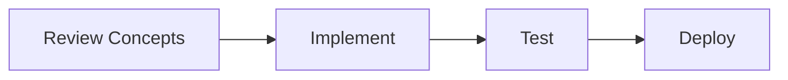

🚀 # 🤝 Mentor Tips: Networking, Resumes, and Cold Emails

> [!TIP]
> **Document Workflow**

Getting an ML/AI internship isn't just about having the best code; it's about making sure the right people *see* your code. Here is the mentor playbook for bypassing the "Apply Online" black hole.

---

✨ ## 📄 1. The Resume: Passing the 6-Second Screen

Recruiters spend an average of 6 seconds looking at your resume. If it's not clear immediately, you're rejected.

🔍 ### The "Do's":
- **One Page Only:** If you are looking for an internship, you do not have enough experience for two pages.
- **Action + Impact Format:** Bullet points should follow: `[Action Word] + [What you did] + [Result/Impact]`.
  - *Bad:* "Used XGBoost to predict churn."
  - *Good:* "Developed an XGBoost churn prediction model handling 50k+ records, resulting in an F1-score of 0.85 and identifying key drivers for customer retention."
- **Hyperlink Everything:** Link your GitHub repo directly in the project title. Link your LinkedIn at the top.
- **Skills Section at the Top:** Make it scannable. 
  - *Languages:* Python, SQL, C++
  - *ML/AI:* PyTorch, Scikit-Learn, LangChain, Transformers
  - *Tools:* Git, Docker, FastAPI, AWS

🔍 ### The "Don'ts":
- **No Progress Bars:** Never put "Python: 80%". It means nothing and shows you think you know 80% of a massive language.
- **No Basic Projects:** Remove the Titanic dataset or MNIST digit classifier. Everyone has them.

---

✨ ## 📧 2. Cold Emailing: Bypassing the Portal

When you apply on a company portal, you are competing against 5,000 other people. When you cold email an engineering manager, you are competing against maybe 3 people.

🔍 ### Who to target:
Search LinkedIn for: `Head of Data Science`, `Machine Learning Manager`, `Lead AI Engineer`, or `CTO` (for startups). Do NOT email HR or Recruiters for technical roles if you can avoid it—they only check off boxes, whereas technical leaders can recognize your GitHub potential.

🔍 ### Cold Email / LinkedIn Message Template:

**Subject:** ML Engineering Intern Candidate - [Your Name] - [University/Current Role]

> Hi [Name],
>
> I saw your recent post about [Topic they posted about] / I’ve been following [Company Name]'s work on [Specific Product/Feature] and was really impressed by how you solved [Specific Problem].
>
> I’m currently a [Year/Major] at [University] specializing in ML and Generative AI. Recently, I built an end-to-end [Mention your best project, e.g., Multi-Modal RAG system] using [Tech Stack: e.g., LangChain and FastAPI], which [mention the result/impact]. 
> 
> Here is a quick 1-minute demo video of it working: [Link to YouTube/Loom demo]
> Source Code: [GitHub Link]
>
> I am looking for a [Season, e.g., Summer 2024] ML Internship and would love to bring this hands-on experience to your team. Do you have 10 minutes next week for a quick chat about potential opportunities at [Company Name]?
>
> Best regards,
> [Your Name]
> [Link to Resume/Portfolio]

🔍 ### Why this works:
1. **Personalized:** Shows you researched them.
2. **Proof of Skill:** You aren't asking them to trust you; you are *showing* them a video demo.
3. **Clear Ask:** "10 minutes next week."

---

✨ ## 🗣️ 3. The Interview: Behaving Like an Engineer

🔍 ### The "Tell me about your project" Trap
Most interns explain the code: *"First I imported Pandas, then I dropped NA values, then I ran grid search..."* **Wrong.**

**Explain the business value first:**
1. **The Problem:** "I noticed it's hard to parse resumes manually..."
2. **The Approach:** "So I designed an NLP pipeline to extract skills and match them using Sentence Transformers..."
3. **The Trade-offs (Crucial!):** "I initially tried using basic TF-IDF, but I found it lacked semantic understanding, so I upgraded to a lightweight BERT model which improved matching accuracy, even though it added latency."
4. **The Result:** "...ultimately creating a system that processes resumes in under 2 seconds with 90% qualitative accuracy."

*Talking about trade-offs shows maturity.*

🔍 ### Handling Questions You Don't Know
- **Never say:** "I don't know." and stop talking.
- **Say:** "I haven't worked with [Concept] directly, but based on my understanding of [Related Concept], I would assume it works by [Your educated guess]. How does your team utilize it in production?" 
- This shows you can think on your feet and remain curious.

> [!TIP]
> Treat the job hunt like a Machine Learning problem. Your resume is the input, the interview is the model, and the offer is the output. If you aren't getting interviews, fix your input (Resume/Projects/Cold Emails). If you are failing interviews, tune your model (Interview Practice).

<!-- Formatting improvements -->

---
*🎯 **Pro Tip**: Consistency is key in Machine Learning. Keep building and exploring!* 