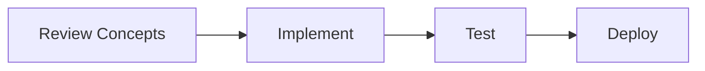

🚀 # Kaggle Competition Guide for ML Portfolio

> [!TIP]
> **Document Workflow**




**Goal:** Use Kaggle to build credible portfolio projects  
**Timeline:** Days 15-17 (3 days) to make first competition submission  
**Realistic Goal:** Top 30-40% (good enough for first portfolio project)

---

✨ ## **Best Kaggle Competitions for Beginners**

🔍 ### **Tier 1: Recommended for First Submission** (Easiest)

| Competition | Type | Size | Difficulty | Why Good |
|------------|------|------|-----------|----------|
| **Titanic** | Classification | 891 samples | Beginner | Classic, lots of tutorials |
| **House Prices** | Regression | 1460 samples | Beginner | Feature engineering focus |
| **MNIST** | Image Classification | 70K images | Beginner | Deep learning intro |

🔍 ### **Tier 2: Good for Learning** (Medium)

| Competition | Type | Size | Difficulty |
|------------|------|------|-----------|
| **Credit Card Fraud** | Classification | 284K samples | Intermediate |
| **Iris Species** | Classification | 150 samples | Beginner |
| **Predict Student Grades** | Regression | Variable | Intermediate |

🔍 ### **Tier 3: Advanced** (For later)

| Competition | Type | Size | Difficulty |
|------------|------|------|-----------|
| **ImageNet** | Image Classification | 1.2M images | Advanced |
| **NLP Competitions** | NLP | Variable | Advanced |
| **Time Series** | Forecasting | Variable | Advanced |

---

✨ ## **Recommended First Competition: House Prices Advanced Regression**

**Link:** https://www.kaggle.com/c/house-prices-advanced-regression-techniques

**Why:** 
- Perfect difficulty level
- Focus on feature engineering (employers love this)
- Active community with good solutions
- Regression problem (easier than classification)

---

✨ ## **How to Approach a Kaggle Competition**

🔍 ### **Step 1: Understand the Problem** (Day 15, 1-2 hours)

```python
🚀 # Load and explore
import pandas as pd
import numpy as np

train = pd.read_csv('train.csv')
test = pd.read_csv('test.csv')

print(train.shape, test.shape)
print(train.head())
print(train.info())
print(train.describe())

🚀 # Check target variable
print(train['SalePrice'].describe())
print(f"Missing values:\n{train.isnull().sum()}")
```

**Questions to answer:**
- What is target variable?
- Train/test split percentage?
- How much missing data?
- Imbalanced classes (if classification)?
- Outliers present?

---

🔍 ### **Step 2: Exploratory Data Analysis** (Day 15, 3-4 hours)

```python
import matplotlib.pyplot as plt
import seaborn as sns

🚀 # 1. Target distribution
plt.hist(train['SalePrice'], bins=50)
plt.show()

🚀 # 2. Correlation with target
corr = train.corr()['SalePrice'].sort_values(ascending=False)
print(corr.head(10))

🚀 # 3. Feature distributions
train.hist(figsize=(15, 10), bins=50)
plt.tight_layout()
plt.show()

🚀 # 4. Missing values heatmap
sns.heatmap(train.isnull(), cbar=False)
plt.show()

🚀 # 5. Relationships
sns.pairplot(train[['SalePrice', 'GrLivArea', 'TotalBsmtSF', 'GarageArea']])
plt.show()
```

**Output:**
- Top 10 features correlated with target
- Feature distributions
- Missing data patterns
- Outliers identification

---

🔍 ### **Step 3: Data Cleaning** (Day 16, 2-3 hours)

```python
🚀 # 1. Handle missing values
missing_pct = train.isnull().sum() / len(train) * 100
missing_pct = missing_pct[missing_pct > 0].sort_values(ascending=False)

🚀 # Strategy:
for col in missing_pct.index:
    if missing_pct[col] > 50:
        train.drop(col, axis=1, inplace=True)  # Too much missing
    elif train[col].dtype == 'object':
        train[col].fillna(train[col].mode()[0], inplace=True)  # Mode for categorical
    else:
        train[col].fillna(train[col].median(), inplace=True)  # Median for numerical

🚀 # 2. Handle outliers (IQR method)
Q1 = train['SalePrice'].quantile(0.25)
Q3 = train['SalePrice'].quantile(0.75)
IQR = Q3 - Q1
outliers = train[(train['SalePrice'] < Q1 - 1.5*IQR) | (train['SalePrice'] > Q3 + 1.5*IQR)]
train = train[~train.index.isin(outliers.index)]

🚀 # 3. Encode categorical variables
train = pd.get_dummies(train, drop_first=True)

🚀 # 4. Scale features (for some models)
from sklearn.preprocessing import StandardScaler
scaler = StandardScaler()
numerical_cols = train.select_dtypes(include=[np.number]).columns
train[numerical_cols] = scaler.fit_transform(train[numerical_cols])
```

---

🔍 ### **Step 4: Feature Engineering** (Day 16, 3-4 hours)

```python
🚀 # Create new features
train['TotalArea'] = train['GrLivArea'] + train['TotalBsmtSF']
train['TotalBaths'] = train['FullBath'] + 0.5 * train['HalfBath']
train['Rooms'] = train['TotRmsAbvGrd']
train['PricePerArea'] = train['SalePrice'] / train['TotalArea']

🚀 # Polynomial features
from sklearn.preprocessing import PolynomialFeatures
poly = PolynomialFeatures(degree=2, include_bias=False)
X_poly = poly.fit_transform(train[['GrLivArea', 'TotalBsmtSF']])

🚀 # Log transformation for skewed features
train['LogSalePrice'] = np.log(train['SalePrice'])
train['LogGrLivArea'] = np.log(train['GrLivArea'] + 1)

🚀 # Binning
train['YearBuiltBucket'] = pd.cut(train['YearBuilt'], bins=5)
```

**Feature Engineering Principles:**
- Domain knowledge first
- Test if feature improves CV score
- Remove highly correlated features
- Target encoding for categorical with high cardinality

---

🔍 ### **Step 5: Model Building & Training** (Day 16-17, 5-6 hours)

```python
from sklearn.model_selection import train_test_split, cross_val_score, KFold
from sklearn.linear_model import Ridge, Lasso
from sklearn.ensemble import RandomForestRegressor, GradientBoostingRegressor
from xgboost import XGBRegressor
from sklearn.metrics import mean_squared_error, r2_score

🚀 # Prepare data
X = train.drop('SalePrice', axis=1)
y = train['SalePrice']

X_train, X_val, y_train, y_val = train_test_split(X, y, test_size=0.2, random_state=42)

🚀 # Train multiple models
models = {
    'Ridge': Ridge(alpha=10.0),
    'Lasso': Lasso(alpha=1.0),
    'RandomForest': RandomForestRegressor(n_estimators=100, max_depth=20, random_state=42),
    'GradientBoosting': GradientBoostingRegressor(n_estimators=100, learning_rate=0.1, random_state=42),
    'XGBoost': XGBRegressor(n_estimators=100, learning_rate=0.1, max_depth=5, random_state=42)
}

results = {}
for name, model in models.items():
    model.fit(X_train, y_train)
    y_pred = model.predict(X_val)
    rmse = np.sqrt(mean_squared_error(y_val, y_pred))
    r2 = r2_score(y_val, y_pred)
    results[name] = {'RMSE': rmse, 'R²': r2}
    print(f"{name}: RMSE={rmse:.4f}, R²={r2:.4f}")

🚀 # Select best model
best_model = 'XGBoost'
```

---

🔍 ### **Step 6: Hyperparameter Tuning** (Day 17, 2-3 hours)

```python
from sklearn.model_selection import GridSearchCV

🚀 # Tune XGBoost
param_grid = {
    'n_estimators': [100, 200, 300],
    'learning_rate': [0.01, 0.05, 0.1],
    'max_depth': [3, 5, 7],
    'subsample': [0.8, 0.9, 1.0]
}

grid_search = GridSearchCV(
    XGBRegressor(random_state=42),
    param_grid,
    cv=5,
    scoring='neg_mean_squared_error',
    n_jobs=-1
)

grid_search.fit(X_train, y_train)
print(f"Best params: {grid_search.best_params_}")
print(f"Best CV RMSE: {np.sqrt(-grid_search.best_score_):.4f}")

best_model = grid_search.best_estimator_
y_pred = best_model.predict(X_val)
print(f"Validation RMSE: {np.sqrt(mean_squared_error(y_val, y_pred)):.4f}")
```

---

🔍 ### **Step 7: Ensemble & Optimize** (Day 17, 1-2 hours)

```python
from sklearn.ensemble import VotingRegressor

🚀 # Combine best models
ensemble = VotingRegressor(
    estimators=[
        ('xgb', XGBRegressor(n_estimators=300, learning_rate=0.1, max_depth=5)),
        ('gb', GradientBoostingRegressor(n_estimators=200, learning_rate=0.1)),
        ('ridge', Ridge(alpha=10.0))
    ]
)

ensemble.fit(X_train, y_train)
y_pred_ensemble = ensemble.predict(X_val)
print(f"Ensemble RMSE: {np.sqrt(mean_squared_error(y_val, y_pred_ensemble)):.4f}")
```

---

🔍 ### **Step 8: Make Predictions & Submit** (Day 17, 1 hour)

```python
🚀 # Apply same preprocessing to test data
test_processed = test.copy()
🚀 # (apply all same transformations as train)

🚀 # Make predictions
X_test = test_processed.drop('Id', axis=1)
predictions = best_model.predict(X_test)

🚀 # Create submission
submission = pd.DataFrame({
    'Id': test['Id'],
    'SalePrice': predictions
})

submission.to_csv('submission.csv', index=False)
print("Submitted!")
```

---

✨ ## **Competition Strategy Tips**

🔍 ### **To Reach Top 30%:**
1. Good EDA (understand data patterns)
2. Proper feature engineering (5-10 new features)
3. Multiple models + ensemble
4. Hyperparameter tuning
5. Cross-validation for robust estimates

🔍 ### **To Reach Top 10%:**
1. All of above
2. Advanced feature engineering
3. Stack multiple ensembles
4. Domain-specific knowledge
5. Leak detection (if any)
6. Careful threshold tuning (if classification)

🔍 ### **Tips:**
- Start simple, iterate
- Document what works and what doesn't
- Look at top solutions (after you submit)
- Join competition discussion forums
- Commit code to GitHub (show your process)
- Write explanation of your approach

---

✨ ## **Common Mistakes to Avoid**

| Mistake | Fix |
|---------|-----|
| Using test data in training | Keep test separate |
| Not handling missing values | Impute or remove strategically |
| Overfitting to leaderboard | Use cross-validation |
| Not comparing baselines | Try simple models first |
| Ignoring feature scaling | Scale for distance-based models |
| Not version controlling | Save different model versions |
| Hard-coded file paths | Use relative paths |
| Poor documentation | Comment your code |

---

✨ ## **After Competition: Portfolio Use**

Once you have submission:

1. **Write Kaggle Notebook Explaining Approach**
   - Go to "Notebooks" tab
   - Create new notebook
   - Explain your solution
   - Share insights

2. **Create GitHub Repository**
   - Fork official repo or create from scratch
   - Include: notebooks, scripts, README
   - Document everything
   - Add link to Kaggle notebook

3. **Use in Interview**
   - "I competed in [competition], achieved top 30%"
   - "Here's my approach: [explain feature engineering]"
   - "What I'd improve: [list improvements]"

4. **LinkedIn Post**
   - Share your submission story
   - Tag your approach/results
   - Show to network

---

✨ ## **Next Kaggle Competition**

After first competition, try:
1. **Different domain:** If first was tabular, try image
2. **Different task:** If first was regression, try classification
3. **Harder problem:** Move up difficulty level

This shows versatility to employers.

---

**Your Portfolio After 3 Competitions:**
- Multiple competitions → Shows real ML experience
- Different domains → Versatility
- GitHub repos → Code quality
- Increasing leaderboard ranks → Growth trajectory
- Documented approach → Communication skills

This is extremely attractive to hiring managers!

<!-- Formatting improvements -->


---
*🎯 **Pro Tip**: Consistency is key in Machine Learning. Keep building and exploring!*